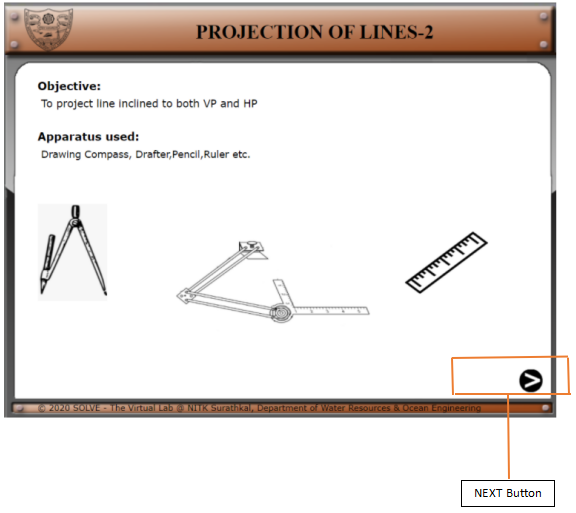
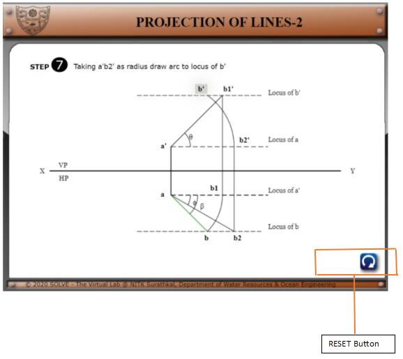

1)  .Click on **“Projection of Line”** the following window will open.
    Click on the **NEXT** button to proceed.

2)  .Click on **a’** for next step of construction. Follow the
    same.(**a’\<\<a\<\<b1’\<\<b1\<\<b\<\<b2\<\<b2’\<\<b’**)

