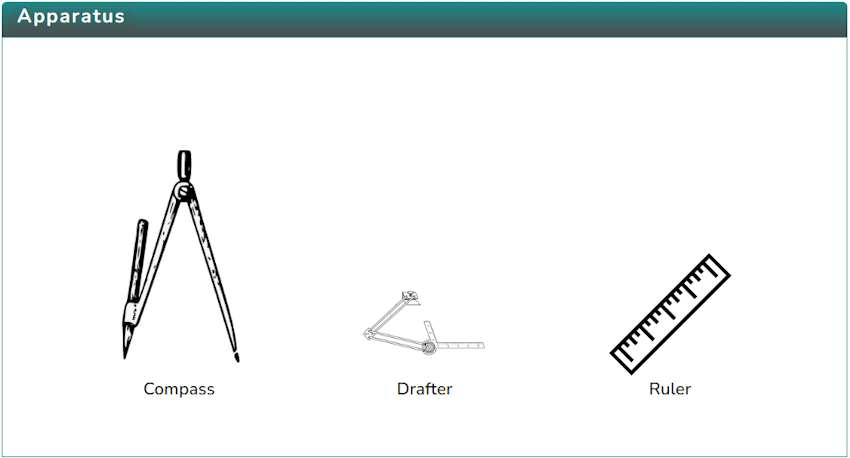
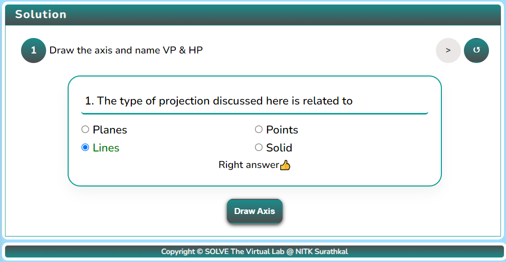
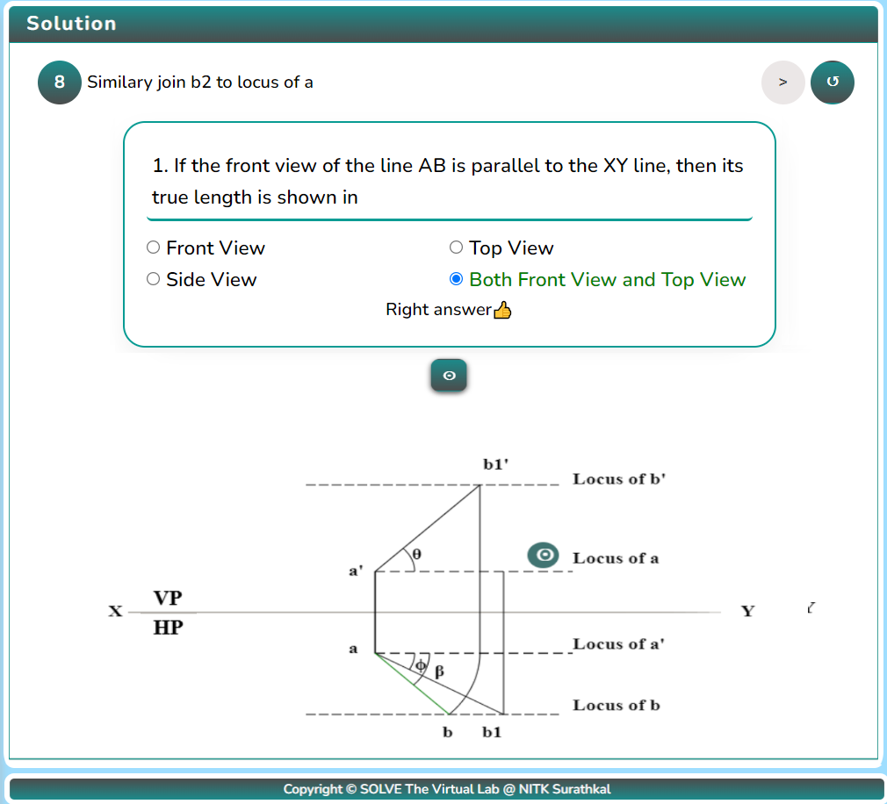

### Procedure

1. Click on the Objective icon  to view the objective of the simulation.

   

2. Click on the Apparatus icon  to check the tools required for this simulation.

   

3. Click on the Solution icon  to proceed with further simulation steps.

   

4. Answer the questions that are either based on the data or are from the procedure of the experiment.  
   Answer the question to initiate the simulator, i.e., to draw the axis.

   

5. After obtaining the XY axis, mark the planes by clicking the button

   

6. After naming the planes, draw the line.

   

7. After drawing the line, click the “Next Step” Button to proceed.

   

8. Click on “a′” to extend it.

   

9. After clicking the “Next Step” button, click the “a” button to proceed.

   

10. Click the “b1′” button to draw the lines with true length and the given angles.

    

11. After clicking “b1′” and the “Next Step” button, click the “Θ” button to join b1′ to the locus of a′.

    

12. Click the “Next Step” button to proceed, and click the “b” button to draw an arc to the locus of b.

    

13. Click the “Next Button” and the “b1” button to join a and b to get the top view.

    

14.Click the “Next Step” and the “Θ” to join b2 to the locus of a.

    

15. Click the “Next Step” and “b′” to draw an arc to the locus of b′.

    

16. Finally, completing the simulation.

    

17. After performing the experiment, click on the Reset button  to restart the experiment.
