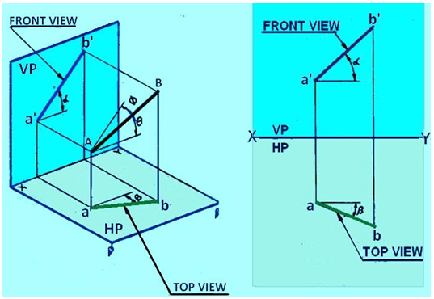

**THEORY:**

True Length: Actual length of a given
line, length of the projection is less than the length of True length.

Theta: It is the angle made by the actual
line with HP(wrt to XY line)

Phi: It is the angle made by the actual
line with VP(wrt to XY line).

Alpha: Apparent angle made by projection
in the HP with the XY line.

Beta: Apparent angle made by projection
in the VP with the XY line.

Traces of lines: It is defined as the
point at which the given line if produced, meets, or intersects the
plane.

  - When the line meets HP(or the extended portion to HP), the point at
    which the lines trace(HT)of the line and denoted by letter
    H. Similarly to VT and point denoted by V.

  - When the line parallel to both HP & VP, there will be no trace on
    the said planes.

    When a line is inclined to both HP and VP,  the  apparent  inclination of the line to both the projection planes will be different from the actual inclinations. Similarly the projected length of the lines on to the planes will not be the same as the true length f the line. The following notation will be used for the inclinations and length of the lines for this entire lecture series:

    Actual inclinations are θ degrees to HP  and  φ degrees to VP.
    Apparent Inclinations are a and b to HP and VP respectively.
    The Apparent Lengths of line AB are ab and a΄b΄ in the top view and front view respectively

source: https://nptel.ac.in/courses/112/103/112103019/
