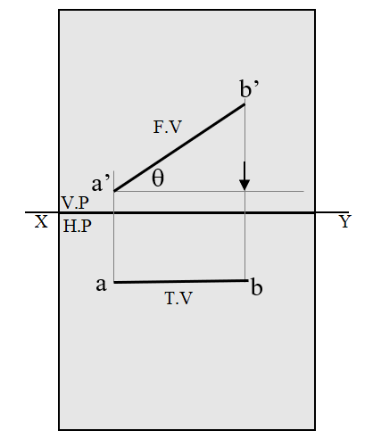

## Introduction

  
 A straight line can be defined as the shortest distance between two points. The projection of these two points translates on to lines as well.
 
The position of a straight line is described with respect to the two reference planes. It may be:
 
1. Parallel to one or both the planes, as shown in Fig. 1.

Fig. 1 Line Parallel to both the planes.

 
2. Contained by one or both the planes, as shown in Fig. 2. 

Fig. 2 Line inclined to HP and parallel to VP.

 
3. Perpendicular to one of the planes, as shown in Fig. 3.

Fig. 3 Line perpendicular to HP

 
4. Inclined to one plane and parallel to the other, as shown in Fig. 4.

Fig. 4 Line Parallel to HP inclined to VP

 
5. Inclined to both the planes, as shown in Fig. 5.

Fig. 5 Line inclined to both the planes

